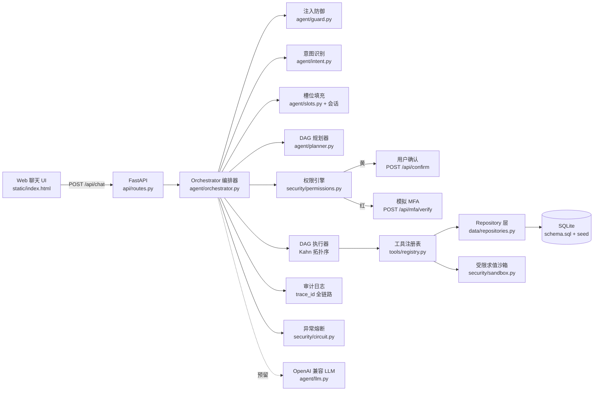
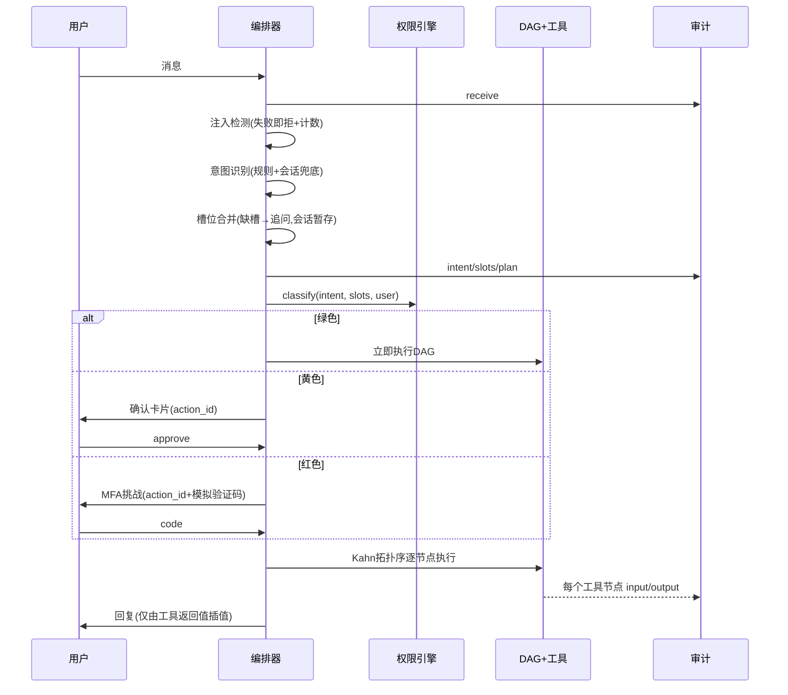

# 系统架构

## 总体架构



## 分层与解耦原则

| 层 | 目录 | 职责 | 依赖 |
|---|---|---|---|
| 接入层 | `app/api`, `static/` | REST 端点、Web UI | 编排层 |
| 编排层 | `app/agent/` | 意图→槽位→DAG→权限→确认/MFA→执行→审计 | 安全层、工具层 |
| 安全层 | `app/security/` | 权限分级、MFA、审计、熔断、沙箱 | 数据层(仅审计/待办表) |
| 工具层 | `app/tools/` | 业务原子操作，经注册表暴露 | 数据层 |
| 数据层 | `app/data/` | 全部 SQL、schema、种子数据 | 无 |

**更换数据源（SQLite → Postgres / 真实银行 mock 接口）只需实现 `repositories.py` 同签名函数，其余层零改动。**

## Agent 工作流（单回合）



## DAG 示例（智能转账）

```
resolve_payee ──► check_balance ──► execute_transfer
（联系人解析）      （余额充足性）      （落库+扣减余额）
```

- 模板定义在 `agent/planner.py`，执行顺序由 Kahn 算法拓扑排序得出，存在环则规划失败。
- 每个节点执行结果写入 ctx.results 供下游节点消费，并逐节点写审计。

## 核心算法

1. **权限动态分档**：`transferred_today + amount > 1000` → 红，否则黄；查实时累计来自 transactions 当日成功转出求和。
2. **异常交易识别**：均值+3σ 大额检测 + 同商户同金额 ≥3 次重复扣费识别（隐形订阅）。
3. **沙箱求值**：AST 白名单（算术/白名单函数/白名单变量），禁止属性访问、导入、推导式、下标。
4. **幻觉防护**：回复模板只插值工具返回字段；无工具结果即无数字输出。

## 前端架构（frontend/，Vite + React 19 + TS）

```
src/
├── App.tsx                  # 布局 + 对话状态机（send/decide/verifyMfa）
├── api.ts / types.ts        # REST 封装与类型
└── components/
    ├── ConfirmCard.tsx      # 黄色确认卡片（聊天内嵌）
    ├── MfaModal.tsx         # 红色 MFA 弹窗（Input.OTP 六格验证码）
    ├── BillCharts.tsx       # Recharts 饼图/柱状图（AnimatePresence 展开）
    ├── ThoughtPanel.tsx     # ThoughtChain 决策链（审计日志→思维链节点）
    ├── AuditDrawer.tsx      # Timeline 审计抽屉（3s 轮询刷新）
    └── AnimatedNumber.tsx   # Motion 数字滚动（余额）
```

技术选型：Ant Design 6（企业级组件）+ Ant Design X（AI 对话/思维链组件）+ Motion（动效）+ Recharts（图表）+ canvas-confetti（庆祝效果）。
生产部署：`npm run build` 产物 `dist/` 由 FastAPI 直接托管（`app/main.py` 优先挂载 `frontend/dist`）；开发态 Vite 5173 代理 `/api` → 8000。
